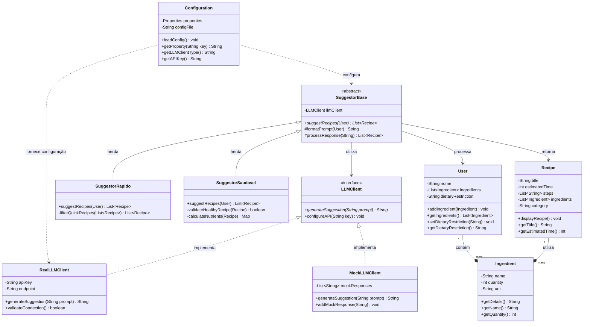

# ChefAI — Sugestor de Receitas Inteligente

### Sobre o projeto

* O ChefAI é um sistema desenvolvido em Java, utilizando o BlueJ, com o objetivo de sugerir receitas rápidas (até 30 minutos) com base nos ingredientes informados pelo usuário.
* O projeto foi criado como atividade prática para aplicar os conceitos de Programação Orientada a Objetos (POO) e integração com APIs de Language Models (LLMs), utilizando boas práticas de organização de código e segurança.

### Objetivos do sistema

* Ajudar usuários a aproveitarem melhor os ingredientes disponíveis
* Sugerir até 3 receitas rápidas
* Considerar restrições alimentares
* Demonstrar a aplicação prática de POO

### Conceitos de POO aplicados
* Encapsulamento
* Abstração
* Herança
* Polimorfismo
* Composição

### Exemplos no projeto:

User, Ingredient e Recipe → encapsulamento

User contém lista de Ingredient → composição

SuggestorBase → abstração

SuggestorRapido e SuggestorSaudavel → herança

LLMClient + MockLLMClient → polimorfismo

### Diagrama de Classes

**Legenda do Diagrama:**
- `-` = privado, `+` = público, `#` = protegido
- `<<abstract>>` = classe abstrata, `<<interface>>` = interface
- `--*` = composição, `<|--` = herança, `<|..` = implementação

### Tecnologias utilizadas

* Java
* BlueJ
* Integração simulada com LLM (modo mock)
* API configurável via arquivo externo

### Configuração do projeto

* Clone ou baixe o repositório
* Abra a pasta no BlueJ
* Copie o arquivo:
* config.properties.example → config.properties

(Opcional) Insira sua API key real dentro do arquivo config.properties

### Exemplos de uso

*Entrada:*

Nome: Gio

Ingrediente: ovo

Quantidade: 2

Restrição: nenhuma

*Saída:*

=== Omelete Rápida ===

Tempo estimado: 10 minutos

...

### Segurança
* Chaves de API não são armazenadas no código
* Utilização de arquivo externo config.properties
* Versão mock disponível para testes offline
